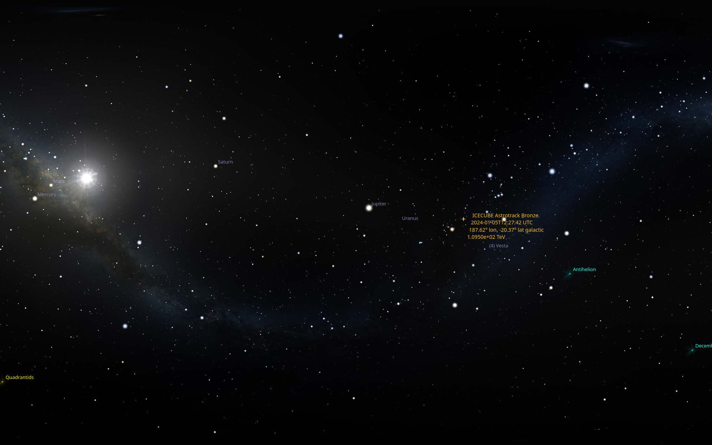

IceCube GCN Notive Wallpaper Generator
======================

`stellarium-gcn-wp` is a script to automatically generate and set a desktop wallpaper
for an IceCube GCN notice using stellarium.

The generated wallpapers show a rendering of the sky from an observers position
(by default, the IceCube Neutrino Observatory at the south pole), at the time
the neutrino event occurred. The position and some information about the event
is marked in the image.

Requirements
------------
This will (probably) only work on Linux. These external dependencies need to be installed:
  * [Stellarium](https://stellarium.org), which is used to render the images
  * Xvfb, which is used to run stellarium in the background
  * xdotool, to control the stellarium window inside Xvfb

Additionally, you will need a `client_id` and `client_secret` to subscribe to GCN
notices. You can sign up to receive notices on the [NASA GCN website](https://gcn.nasa.gov/)

Quickstart
----
* Add your `client_id` and `client_secret` to `settings.py`
* Look through `settings.py` for any other configuration changes you might want to make
  * `out_file_name` controlls where the rendered images get saved to
  * If you don't run KDE, you'll want to set `post_render_callback` option to something that sets a wallpaper for 
    your desktop environment (or does whatever else you want with the image). Functions for setting KDE and Gnome3 desktop
    backgrounds are included in `hooks.py`
* Run `poetry install`
* Run `poetry run stellarium-gcn-wp -s track --init-tracking` 
  * This will initialize tracking GCN notices to start at the most recent one
* Run `poetry run stellarium-gcn-wp -s track`
  * This will run indefinitely. Whenever a GCN notive is received, a new wallpaper
    will be generated and set according to your configuration
* If you just want to generate one wallpaper right now, you can run 
  `poetry run stellarium-gcn-wp -s last -1` instead of the previous two commands